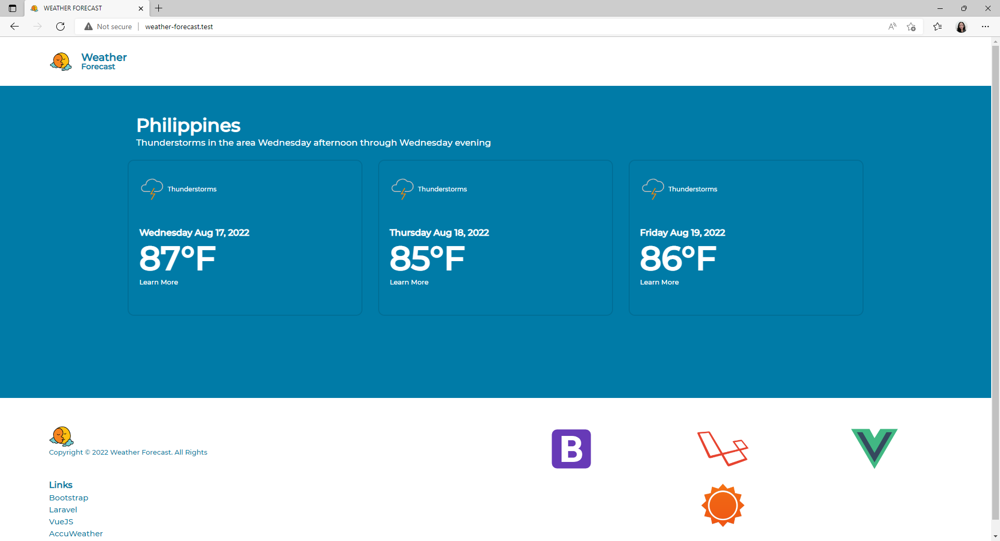
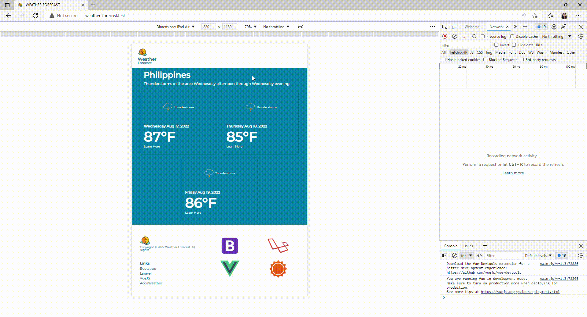
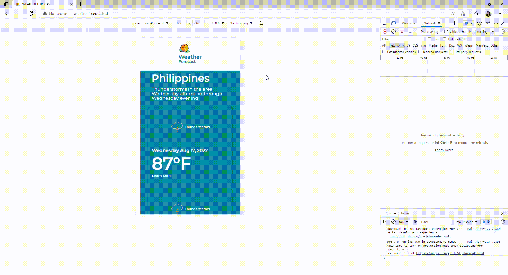

# Tech Stack

Backend: [Laravel 5.8](https://laravel.com/docs/5.8/readme)

Frontend: [VueJS v2](https://v2.vuejs.org/)

    Started:  8/16/2022 6:30PM
    Finished: 8/17/2022 8:50PM
    Total: 1 day, 2 hours, 20 minutes

# Getting Started

### Install from repository

Clone the repository:

    git clone https://github.com/monettayy/weather-forecast.git

Navigate to the directory and run:

    composer install

Copy the example .env file:

    cp .env.example .env

Generate an application key:

    php artisan key:generate

Run Mix tasks:

    npm run prod

View the website:

    php artisan serve
    
### Setup API KEY

Go to the .env File and put your API Key from AccuWeather 

    ACCUWEATHER_API_KEY=your-api-key-here

# Testing
## Sample Output
Large Screen

Medium Screen

Small Screen
